# AI-Powered Assistant Platform

A complete, production-ready AI assistant platform built with AWS Serverless, TypeScript, and modern web technologies. Features Claude 3 integration via AWS Bedrock, real-time web search, sandboxed code execution, and secure authentication with a layered enterprise architecture.


## 🏗️ System Architecture

```mermaid
graph TD
    User[👤 User] --> Frontend[🌐 Next.js Frontend]
    Frontend --"JWT Auth"--> API[🚪 API Gateway HTTP API]
    API --"Validate Token"--> Cognito[🔐 Cognito User Pool]
    API --"Route Request"--> Lambda[⚡ Backend Lambdas]

    Lambda --> Config[⚙️ ConfigService]
    Lambda --> Middleware[🛡️ Middleware Pipeline]
    Lambda --> Controller[🎯 ChatController]
    Controller --> Service[🧠 ChatService]
    Service --> RouteService[🛤️ RouteService]

    RouteService --"Intent: general"--> GenericAgent[🤖 GenericAgent]
    RouteService --"Intent: code"--> CodingAgent[💻 CodingAgent]
    RouteService --"Intent: search"--> FinancialAgent[💰 FinancialAgent]

    GenericAgent --> LLM[� LLMService]
    CodingAgent --> LLM
    CodingAgent --> CodeInterpreter[� CodeInterpreter Tool]
    FinancialAgent --> LLM
    FinancialAgent --> WebSearch[🔍 WebSearch Tool]

    LLM --"Invoke Model"--> Bedrock[🎭 AWS Bedrock Claude 3]
    Service --> Repo[💾 Repository Layer]
    Repo --"Store/Retrieve"--> DDB[📊 DynamoDB]

    CodeInterpreter --"Execute Code"--> CodeExec[� CodeExec Lambda]
    WebSearch --"Get API Key"--> Secrets[🔑 Secrets Manager]
    WebSearch --"Search Query"--> Bing[🔍 Bing Search API]

    style Frontend fill:#e1f5fe
    style Lambda fill:#f3e5f5
    style Bedrock fill:#fff3e0
    style DDB fill:#e8f5e8
    style GenericAgent fill:#e8f5e8
    style CodingAgent fill:#fff3e0
    style FinancialAgent fill:#f3e5f5
```



## 🚀 Sequence Diagram - Chat Flow


## 🎯 Features

### ✅ **Core Capabilities**

- **🤖 AI Conversations**: Claude 3 integration via AWS Bedrock
- **🔄 Real-time Streaming**: Server-sent events for live responses
- **💾 Conversation History**: Persistent chat sessions in DynamoDB
- **🔍 Web Search**: Bing Search API integration with financial focus
- **🐍 Code Execution**: Sandboxed Python/JavaScript execution
- **🔐 Secure Authentication**: JWT-based auth with Cognito

### ✅ **Enterprise Architecture**

- **🏗️ Layered Design**: Clean separation of concerns
- **🛡️ Middleware Pipeline**: Auth, validation, logging, error handling
- **⚙️ Configuration Management**: Environment-driven with validation
- **📊 Error Handling**: Centralized with proper HTTP status codes
- **🔧 Dependency Injection**: Interface-based services
- **📝 Type Safety**: Full TypeScript implementation

### 🤖 **Intelligent Agent System**

The platform features a sophisticated agent routing system that automatically determines the best way to handle user requests:

#### **Agent Architecture Status**

**✅ Currently Implemented:**

- **🔀 RouteService**: Intent classification with keyword-based routing
- **🤖 LLMService**: Direct Bedrock Claude integration for all requests
- **📊 Basic Intent Classification**: Detects `web_search`, `code_execution`, and `general` intents

**🚧 Planned Implementation:**

- **🤖 GenericAgent**: Standard chat responses for general conversations
- **💻 CodingAgent**: Code generation → extraction → execution → results
- **💰 FinancialAgent**: Web search → context → AI analysis with disclaimers

#### **Tool System Status**

**✅ Currently Implemented:**

- **🐍 CodeExec Lambda**: Sandboxed Python/JavaScript execution environment
- **🔑 Secrets Manager Integration**: Secure API key management

**🚧 Planned Implementation:**

- **� WebSearch Tool**: Bing API integration for real-time data
- **🐍 CodeInterpreter Tool**: Interface to CodeExec Lambda
- **🔧 Tool Registry**: Centralized tool management and discovery

#### **Current Behavior**

Currently, the `RouteService` classifies intents but falls back to direct LLM calls:

```typescript
// Current RouteService implementation
switch (intent) {
  case "web_search":
    console.log("Web search intent detected, falling back to general LLM");
    return await this.llmService.invokeNonStreaming(messages);
  case "code_execution":
    console.log("Code execution intent detected, falling back to general LLM");
    return await this.llmService.invokeNonStreaming(messages);
  case "general":
  default:
    return await this.llmService.invokeNonStreaming(messages);
}
```

The sequence diagram shows the **intended architecture** - the actual agent and tool implementation is the next development phase.

## 🚀 Current Deployment Status

**✅ LIVE DEPLOYMENT** - Stage: `dev2` - Region: `eu-north-1`

- **🌐 API Gateway**: `https://bhrw5dk8h8.execute-api.eu-north-1.amazonaws.com`
- **🔐 Cognito Pool**: `eu-north-1_CLzkKYXfB`
- **📊 DynamoDB**: `AssistantData` (Pay-per-request)
- **🤖 Bedrock Model**: `anthropic.claude-3-haiku-20240307-v1:0`
- **✅ Authentication**: WORKING
- **✅ Chat API**: READY

## 📁 Project Structure

```
ai-assistant/
├── 📂 frontend/                    # Next.js React application
│   ├── src/
│   │   ├── pages/                 # Next.js pages (login, chat, index)
│   │   ├── lib/                   # API client and utilities
│   │   └── styles/                # Tailwind CSS styles
│   ├── package.json               # Frontend dependencies
│   └── next.config.js             # Next.js configuration
│
├── 📂 backend/                     # Serverless Lambda backend
│   ├── src/
│   │   ├── 🔐 auth/               # Authentication handlers
│   │   │   └── login.ts           # Cognito login handler
│   │   ├── 🏗️ types/              # TypeScript definitions
│   │   ├── ⚙️ config/             # ConfigService singleton
│   │   ├── 🛡️ middleware/         # Auth, validation, logging pipeline
│   │   ├── 🎯 controllers/        # Request/response handling
│   │   │   └── chatController.ts  # Chat request orchestration
│   │   ├── 🧠 services/           # Business logic layer
│   │   │   ├── chatService.ts     # Chat orchestration & history
│   │   │   ├── llmService.ts      # Bedrock Claude integration
│   │   │   └── routeService.ts    # Intent classification & routing
│   │   ├── 💾 repositories/       # Data access layer
│   │   │   ├── conversationRepository.ts
│   │   │   └── messageRepository.ts
│   │   ├── 🛤️ routes/             # Lambda handlers
│   │   │   └── chatRoutes.ts      # Chat API endpoints
│   │   ├── 🔧 utils/              # Utility functions
│   │   └── 🛠️ tools/              # Specialized tools
│   │       └── codeExec.ts        # Sandboxed code execution
│   ├── 📦 dist/                   # Compiled TypeScript
│   ├── layers/                    # Lambda layers
│   │   └── aws-sdk-v3/            # AWS SDK layer
│   ├── package.json               # Backend dependencies
│   ├── serverless.yml             # Serverless config
│   ├── tsconfig.json              # TypeScript config
│   └── .env                       # Environment variables
```

## 🔧 Installation & Setup

### Prerequisites

- **Node.js 20+** and npm
- **AWS CLI v2** configured with appropriate permissions
- **AWS Account** with Bedrock Claude 3 access enabled

### 1. Clone Repository

```bash
git clone <repository-url>
cd ai-assistant
```

### 2. Backend Setup

```bash
cd backend

# Install dependencies
npm install

# Configure environment variables
cp .env.example .env
# Edit .env with your AWS credentials and settings

# Build TypeScript
npm run build

# Deploy to AWS
npm run deploy
```

### 3. Frontend Setup

```bash
cd ../frontend

# Install dependencies
npm install

# Start development server
npm run dev
```

## ⚙️ Configuration

### Environment Variables (.env)

```env
# AWS Configuration
AWS_REGION=eu-north-1
BEDROCK_REGION=eu-north-1
BEDROCK_MODEL_ID=anthropic.claude-3-haiku-20240307-v1:0

# Authentication
COGNITO_USER_POOL_ID=eu-north-1_CLzkKYXfB
COGNITO_APP_CLIENT_ID=48fpl5okdq6id1bidi7v74m08r
COGNITO_APP_CLIENT_SECRET=your-secret-here

# Database
TABLE_NAME=AssistantData

# External APIs
WEBSEARCH_BING_ENDPOINT=https://api.bing.microsoft.com/v7.0/search
WEBSEARCH_BING_SECRET_NAME=your-bing-api-key
CODE_EXEC_FUNCTION=ai-assistant-backend-dev2-codeExec
```

**Note**: The Cognito app client is configured with a client secret, so our authentication implementation includes proper SECRET_HASH generation using HMAC-SHA256.

### 2. Bing API Key Setup (Optional)

If you want web search functionality, store your Bing API key in AWS Secrets Manager:

```bash
aws secretsmanager create-secret \
  --name "WEBSEARCH_BING_API_KEY" \
  --description "Bing Web Search API Key" \
  --secret-string "YOUR_BING_API_KEY_HERE" \
  --region eu-north-1
```

### 3. Development & Testing

#### Start Frontend (Development)

```bash
cd frontend
npm install
npm run dev
```

The frontend will be available at `http://localhost:3000` (or `http://localhost:3001` if port 3000 is in use)

**Frontend Features:**

- ✅ Homepage with auto-redirect to login/chat
- ✅ Login page with test user credentials displayed
- ✅ Chat interface with real-time streaming responses
- ✅ Authentication flow with JWT token management
- ✅ Responsive design with Tailwind CSS

#### Backend Deployment

```bash
cd backend
npm install
cd layers/aws-sdk-v3/nodejs && npm install && cd ../../..
npm run build
npx serverless deploy --stage dev2
```

## 🧪 Testing the Platform

## 📚 API Documentation

### Authentication Endpoints

| Method | Endpoint      | Description                    |
| ------ | ------------- | ------------------------------ |
| `POST` | `/auth/login` | User login with email/password |

### Chat Endpoints

| Method | Endpoint                   | Description                   | Auth Required |
| ------ | -------------------------- | ----------------------------- | ------------- |
| `POST` | `/chat/invoke`             | Non-streaming chat completion | ✅ JWT        |
| `POST` | `/chat/stream`             | Streaming chat completion     | ✅ JWT        |
| `GET`  | `/chat/conversations`      | Get user conversation history | ✅ JWT        |
| `GET`  | `/chat/conversations/{id}` | Get specific conversation     | ✅ JWT        |

### Request/Response Examples

#### Chat Request

```json
POST /chat/invoke
Authorization: Bearer <JWT_TOKEN>
Content-Type: application/json

{
  "prompt": "Hello! How can you help me today?",
  "conversationId": "optional-existing-conversation-id"
}
```

#### Chat Response

```json
{
  "response": "Hello! I'm an AI assistant that can help you with...",
  "conversationId": "generated-uuid-for-new-or-existing-conversation"
}
```

#### Streaming Response

```
POST /chat/stream
# Returns newline-delimited JSON:
{"type":"token","data":"Hello"}
{"type":"token","data":" there!"}
{"type":"final","data":"","metadata":{"conversationId":"uuid"}}
```

## 🏗️ Architecture Deep Dive

### Layered Architecture Pattern

The backend follows enterprise-grade layered architecture:

#### 1. **Types Layer** (`src/types/`)

- Domain models (User, Conversation, Message)
- Service interfaces (ILLMService, IConversationRepository)
- Error classes (AppError, ValidationError, AuthenticationError)

#### 2. **Configuration Layer** (`src/config/`)

- Singleton ConfigService with environment validation
- Type-safe configuration access
- Centralized environment management

#### 3. **Middleware Layer** (`src/middleware/`)

- **AuthMiddleware**: JWT token validation via Cognito
- **ValidationMiddleware**: Request body validation
- **LoggingMiddleware**: Request/response logging
- **ErrorHandlingMiddleware**: Centralized error formatting

#### 4. **Controllers Layer** (`src/controllers/`)

- Request parsing and user extraction
- Middleware pipeline coordination
- Response formatting and streaming

#### 5. **Services Layer** (`src/services/`)

- **ChatService**: Conversation management and orchestration
- **LLMService**: Bedrock integration (streaming + non-streaming)
- **RouteService**: Intent classification and message routing

#### 6. **Repositories Layer** (`src/repositories/`)

- **ConversationRepository**: DynamoDB CRUD for conversations
- **MessageRepository**: DynamoDB CRUD for messages
- Data marshalling/unmarshalling

#### 7. **Routes Layer** (`src/routes/`)

- Lambda function handlers
- Endpoint definitions and routing

#### 8. **Utils Layer** (`src/utils/`)

- Shared utility functions
- ID generation, validation helpers

## 📦 Dependencies

### Backend Dependencies

```json
{
  "dependencies": {
    "@aws-sdk/client-bedrock-runtime": "^3.540.0",
    "@aws-sdk/client-cognito-identity-provider": "^3.540.0",
    "@aws-sdk/client-dynamodb": "^3.540.0",
    "@aws-sdk/client-lambda": "^3.540.0",
    "@aws-sdk/client-secrets-manager": "^3.540.0",
    "@aws-sdk/util-dynamodb": "^3.540.0",
    "jsonwebtoken": "^9.0.2",
    "uuid": "^13.0.0"
  },
  "devDependencies": {
    "@types/node": "^20.11.0",
    "typescript": "^5.4.5",
    "vitest": "^1.0.4"
  }
}
```

### Frontend Dependencies

```json
{
  "dependencies": {
    "next": "^14.2.4",
    "react": "^18.2.0",
    "react-dom": "^18.2.0"
  },
  "devDependencies": {
    "@types/react": "19.1.12",
    "autoprefixer": "^10.4.16",
    "postcss": "^8.4.31",
    "tailwindcss": "^3.4.1",
    "typescript": "^5.4.5"
  }
}
```

## 🔐 Security Considerations

### Authentication & Authorization

- **JWT Tokens**: Issued by AWS Cognito
- **Token Validation**: Performed by API Gateway
- **User Context**: Extracted from validated JWT claims

### Data Protection

- **Encryption**: All data encrypted at rest (DynamoDB)
- **HTTPS**: All API communication over TLS
- **Secrets**: API keys stored in AWS Secrets Manager

### API Security

- **CORS**: Configured for frontend domains
- **Rate Limiting**: Can be configured in API Gateway
- **Input Validation**: Middleware validates all requests

## 🚧 Troubleshooting

### Common Issues

#### 1. **Bedrock Model Access**

```
Error: The provided model identifier is invalid
```

**Solution**: Enable the Claude model in AWS Bedrock console for your region.

#### 2. **Authentication Errors**

```
Error: Authentication failed
```

**Solution**: Check JWT token expiration and Cognito configuration.

#### 3. **Environment Variables**

```
Error: Missing required environment variables
```

**Solution**: Ensure all required variables are set in `.env` file.

### Debug Commands

```bash
# Check serverless deployment
npx serverless info --stage dev

# View CloudWatch logs
npx serverless logs -f chatInvoke --stage dev

# Test Lambda function locally
npx serverless invoke local -f chatInvoke --data '{"body":"{\"prompt\":\"test\"}"}'
```

## 🔮 Future Enhancements

### Planned Features

- [ ] **Multi-modal Support**: Image and document processing
- [ ] **Voice Integration**: Speech-to-text and text-to-speech
- [ ] **Plugin System**: Extensible agent capabilities
- [ ] **Enterprise SSO**: SAML/OIDC integration
- [ ] **Analytics Dashboard**: Usage metrics and insights

### Technical Improvements

- [ ] **GraphQL API**: Alternative to REST endpoints
- [ ] **Event Sourcing**: Enhanced conversation tracking
- [ ] **Microservices**: Service decomposition
- [ ] **Edge Deployment**: CloudFront edge functions

## 📄 License

This project is licensed under the MIT License - see the [LICENSE](LICENSE) file for details.

## 🤝 Contributing

1. Fork the repository
2. Create a feature branch (`git checkout -b feature/amazing-feature`)
3. Commit your changes (`git commit -m 'Add some amazing feature'`)
4. Push to the branch (`git push origin feature/amazing-feature`)
5. Open a Pull Request

---

**Built with ❤️ using AWS Serverless, TypeScript, and modern web technologies.**
--password Password123! \
 --permanent \
 --region eu-north-1

````

### 2. Test Authentication ✅

**WORKING** - Authentication is now fully functional with SECRET_HASH implementation.

**Test Credentials (CORRECTED):**

- **Username**: `testuser` (use username, not email!)
- **Password**: `Password123!`

```bash
curl -X POST https://bhrw5dk8h8.execute-api.eu-north-1.amazonaws.com/auth/login \
  -H "Content-Type: application/json" \
  -d '{"email":"testuser","password":"Password123!"}'
````

**Expected Response**: JSON with `idToken`, `accessToken`, and `refreshToken` - approximately 2000+ characters each.

**Note**: The field is called "email" in the API, but you should use the Cognito username `testuser`, not the email address.

### 3. Test Chat Functionality

```bash
# Replace <ID_TOKEN> with the token from the login response
curl -X POST https://bhrw5dk8h8.execute-api.eu-north-1.amazonaws.com/chat/stream \
  -H "Authorization: Bearer <ID_TOKEN>" \
  -H "Content-Type: application/json" \
  -d '{"prompt":"Hello! Can you write a Python script to calculate fibonacci numbers?"}'
```

## 🛡️ Security Features

- **Sandboxed Code Execution**: Isolated Lambda for running user code with strict limits
- **JWT Authentication**: Cognito-based JWT tokens for API access
- **IAM Permissions**: Principle of least privilege for all AWS resources
- **VPC Isolation**: Recommended for production code execution environment
- **Rate Limiting**: Consider API Gateway throttling for production use

## 🔍 Troubleshooting

- **401 Unauthorized**: Check JWT authorizer config, Cognito pool/client IDs
- **Bedrock model access**: Ensure Claude 3.7 Sonnet is enabled and IAM permissions are correct
- **Secrets Manager**: Ensure Lambda has `secretsmanager:GetSecretValue` for Bing key
- **Streaming issues**: API Gateway supports `Transfer-Encoding: chunked`, no compression

## � Current Features

- **Multi-Agent Architecture**: Specialized agents for different use cases (coding, finance, general)
- **Real-time Web Search**: Integrated Bing Web Search API for current information
- **Code Execution**: Secure, sandboxed Python code execution environment
- **Streaming Responses**: Real-time streaming chat interface
- **Intent Classification**: Automatic routing to appropriate specialized agents
- **Conversation History**: DynamoDB-backed conversation persistence
- **Modern Stack**: TypeScript, AWS Serverless, Next.js, Tailwind CSS

## 📋 Requirements

- AWS Account with Bedrock access (Claude 3.7 Sonnet enabled)
- Node.js 20+ and npm
- AWS CLI v2 configured
- Bing Search API key (optional, for web search functionality)

## 📝 License

This project is provided as-is for educational and development purposes.
